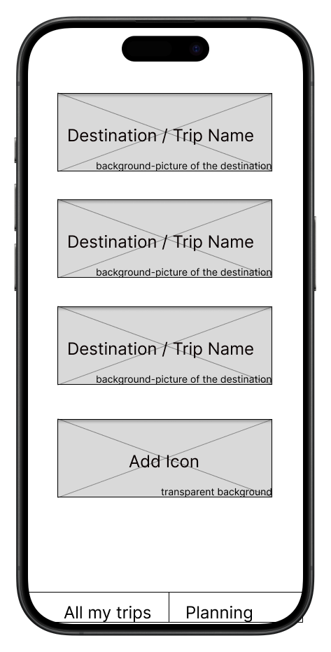
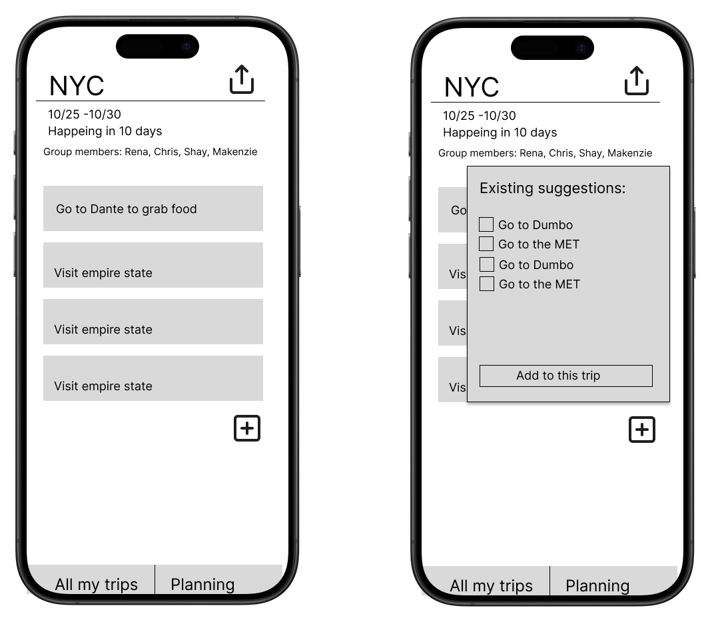

# User Experience Design

## App map and Wireframe

### App map

### Wireframe

* Title: All my trips
* This is the main page of our app. Users begin using the app with this page. It has a list of all the upcoming trips, in the order of the earlist start date. 

* Title: Trip Detail
* Users are able to see the detail information of the selected trip.

The diagrams must be displayed in a logical order and in a visual size that is easy to view when posted on GitHub.com.
Make this document easy-to-read, with clear headings and sub-headings, and good formatting of text.
For the wireframe diagrams, include the title of each diagram, as well as a simple explanation of the purpose of the screen it represents.
Any functionality of the screen that is not obvious should be written into the document.